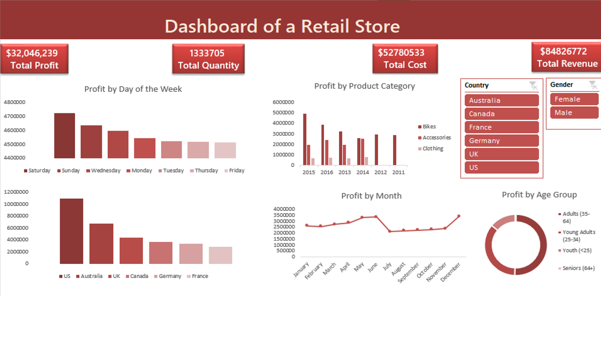

# Bike_sales

I made five Microsoft Excel Dashboards to demonstrate my Excel skill and this is a bonus dashboard the sixth one, the data used is for a retail store in the USA.
For this project to be clean a little data preprocessing is necessary, some of the columns cleaned include age group and gender. Age_group contains values in the following format Youth (<25), Young Adult (25-34), Adult (35-64), seniors (64+) so the values are converted to read Youth, Young Adult, Adult and seniors.
The gender values are represented with the first letter of the gender so the gender are now spelt out in full to read male and female.
Day of the week is another column that was generated from the date column
The insight found from the data include:
The five highest selling product include mountain-200 Black, 38, Road 150 Red 62, mountain-200 silver, 42, Sport-100 Helmet Red and mountain-200 silver, 32
US constitute the highest profit while France is the country with the lowest profit
It is observed that the only product category sold in 2011 and 2012 were bikes resulting in those years low profit
Bike category is the best seller from the inception
The month that gave the best profit is December, the lowest profit was made in July 
Highest profit was recorded in 2016 while the lowest profit was recorded in 2011
Highest profit is realized on Saturday while Monday gave the smallest profit 

